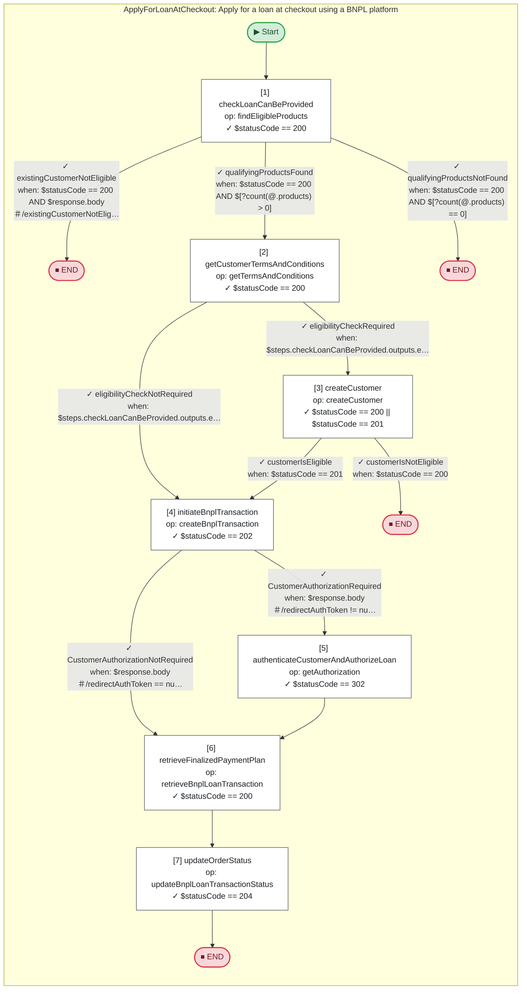

```mermaid
flowchart TD
    %% BNPL Workflow description

    subgraph wf0_sub["ApplyForLoanAtCheckout: Apply for a loan at checkout using a BNPL platform"]
        direction TB
        wf0_start(["▶ Start"])
        wf0_start --> wf0_s0
        wf0_s0["[1] checkLoanCanBeProvided<br/>op: findEligibleProducts<br/>✓ $statusCode == 200"]
        wf0_end0(["⏹ END"])
        wf0_s0 -->|"✓ existingCustomerNotEligible<br/>when: $statusCode == 200 AND $response.body＃/existingCustomerNotElig…"| wf0_end0
        wf0_s0 -->|"✓ qualifyingProductsFound<br/>when: $statusCode == 200 AND $[?count(@.products) > 0]"| wf0_s1
        wf0_end1(["⏹ END"])
        wf0_s0 -->|"✓ qualifyingProductsNotFound<br/>when: $statusCode == 200 AND $[?count(@.products) == 0]"| wf0_end1
        wf0_s1["[2] getCustomerTermsAndConditions<br/>op: getTermsAndConditions<br/>✓ $statusCode == 200"]
        wf0_s1 -->|"✓ eligibilityCheckRequired<br/>when: $steps.checkLoanCanBeProvided.outputs.e…"| wf0_s2
        wf0_s1 -->|"✓ eligibilityCheckNotRequired<br/>when: $steps.checkLoanCanBeProvided.outputs.e…"| wf0_s3
        wf0_s2["[3] createCustomer<br/>op: createCustomer<br/>✓ $statusCode == 200 || $statusCode == 201"]
        wf0_s2 -->|"✓ customerIsEligible<br/>when: $statusCode == 201"| wf0_s3
        wf0_end2(["⏹ END"])
        wf0_s2 -->|"✓ customerIsNotEligible<br/>when: $statusCode == 200"| wf0_end2
        wf0_s3["[4] initiateBnplTransaction<br/>op: createBnplTransaction<br/>✓ $statusCode == 202"]
        wf0_s3 -->|"✓ CustomerAuthorizationRequired<br/>when: $response.body＃/redirectAuthToken != nu…"| wf0_s4
        wf0_s3 -->|"✓ CustomerAuthorizationNotRequired<br/>when: $response.body＃/redirectAuthToken == nu…"| wf0_s5
        wf0_s4["[5] authenticateCustomerAndAuthorizeLoan<br/>op: getAuthorization<br/>✓ $statusCode == 302"]
        wf0_s4 --> wf0_s5
        wf0_s5["[6] retrieveFinalizedPaymentPlan<br/>op: retrieveBnplLoanTransaction<br/>✓ $statusCode == 200"]
        wf0_s5 --> wf0_s6
        wf0_s6["[7] updateOrderStatus<br/>op: updateBnplLoanTransactionStatus<br/>✓ $statusCode == 204"]
        wf0_end3(["⏹ END"])
        wf0_s6 --> wf0_end3
        class wf0_start startNode
        class wf0_s0 stepNode
        class wf0_s1 stepNode
        class wf0_s2 stepNode
        class wf0_s3 stepNode
        class wf0_s4 stepNode
        class wf0_s5 stepNode
        class wf0_s6 stepNode
        class wf0_end0 endNode
        class wf0_end1 endNode
        class wf0_end2 endNode
        class wf0_end3 endNode
    end

    classDef startNode fill:#d4edda,stroke:#28a745,stroke-width:2px,color:#155724
    classDef stepNode fill:#ffffff,stroke:#495057,stroke-width:1px,color:#212529
    classDef endNode fill:#f8d7da,stroke:#dc3545,stroke-width:2px,color:#721c24
```
