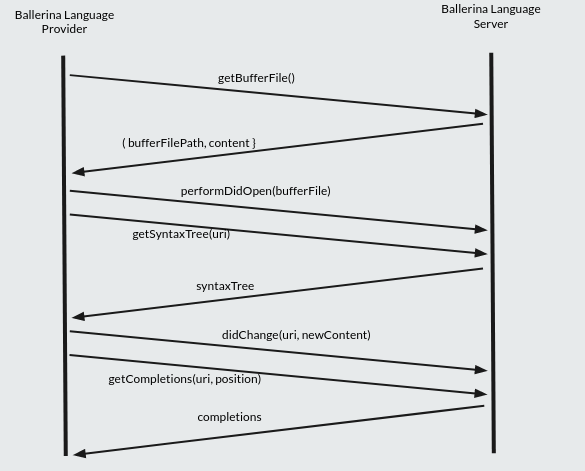

# Ballerina notebook

Ballerina notebook files can be created using the `.balnotebook` extension or using the palette command.

## Features

-   Code execution
    -   Notebook cells can be executed using the `Run` button available at the left side of the cell or using `shift` + `enter` keys. Additionally `Run All`, `Execute Above Cells`, `Execute Cell and Below`, `Clear outputs of All Cells` and `Restart Notebook` actions are available through the user interface.
-   Code completions
-   Rich outputs
    -   JSON view
    -   Table view
    -   XML view
-   Debug support
-   Variable view
-   Integration with CLI commands

## Implementation details

### File structure

```txt
src/notebook/
    ├── activator.ts
    ├── constants.ts
    ├── debugger.ts
    ├── index.ts
    ├── languageProvider.ts
    ├── notebookController.ts
    ├── notebookSerializer.ts
    ├── utils.ts
    └── variableView.ts
```

Each file provides a single purpose for the application.

> 1. activator.ts
>     - handles registering and enabling of the commands associated with the notebook.
> 2. constants.ts
>     - contains constants associated with the extension.
> 3. debugger.ts
>     - everything related to notebook debugger is handles here.
> 4. index.ts
>     - entry point for the notebook.
> 5. languageProvider.ts
>     - provides code completions (can use to extend language capabilities).
> 6. notebookController.ts
>     - handles code execution and rendering of the generated output.
> 7. notebookSerializer.ts
>     - to save the notebook.
> 8. utils.ts
>     - set of utility functions.
> 9. variableView.ts
>     - controls the variale view.

### Code execution

Code exection happens through following steps,

1. Collect content of the cell.
2. If content is empty, remove previously declared vars and types from cell if there was any.
3. If content starts with `bal`, handle it as a CLI command using the `bal home` set for current workspace.
4. Else content executes through Ballerina shell and gets the resulted output.
5. Output will be append to the notebook cell with the appopriate mime type using the notebook render.

    > `web/notebook-renderer` contains implementations for each mime type.

6. Finally, updates the declarations associates with the cell using the meta info.

### Code completions

Ballerina notebook cells use `vscode-notebook-cell` as their scheme type in Uris.

Since Ballerina compiler does not provide support for `vscode-notebook-cell` scheme type or in-memory source streams, the temporary `.bal` file created by Ballerina shell has been used to provide completions.

Another temporary `.bal` file will be created using the content of the shell `.bal` file, which will change according to changes in notebook cell and details of positions and Uri details are used to get code completions from the Ballerina language server.

Steps follows in code completions can summerized as following,



## Debugging

### Requirements

-   Node: >= v16.13.0
-   npm: >= v8.3.0
-   VSCode: >= 1.67.0

1. Clone the repository.

    ```sh
    git clone https://github.com/wso2/ballerina-plugin-vscode.git
    ```

2. Build the extension with the current implentation to install and build the requirements using following command

    ```sh
    ./gradlew build -x test -x uiTest
    ```

    in Windows,

    ```sh
    gradlew.bat -x test -x uiTest
    ```

    > **Info:** This is done to install dependencies for the extension and build the web libraries required by the extension. Otherwise you can run `npm install` in the root directory, build the required libraries and put them in relavent directories. For `notebook-renderer` and `variable-view` its `resources/jslibs` in the root directory of the extension.

3. Add your changes to the notebook implementation and to run the changed extension, inside the editor, press F5. This will compile and run the extension in a new Extension Development Host window.

**Tips**

-   For the changes done in `variable-view` and `notebook-renderer` storybook testing can be used. To view inside the extension, build the lib for them using `npm build` and put the built lib inside `resources/jslibs` in the root directory.
-   Set `LSDEBUG` to `true` to debug for the changes done the language server. After running the extension via `F5`, run the language server using `remote-debug`.

## Details on notebook debugger

Since it is required to compile a source file, to support debugging in the notebook, a temporary `.bal` file is used.

All the successfully ran cells' content which are above the cell that ran the debug will be in the module level of the temporary `.bal` file, and the content of the cell which ran debug will put inside the main function of the `.bal` file.

Due to this, flow of the notebook should follow the same flow as a simple `.bal` file, should follow grammar rules including semicolons which is not a requirement when executing code snippets.

Finally, requests send to the debug adapter by VS Code and responses coming from debug adapter to VS Code will be mapped from cell to line in temporary `.bal` file and from line in temporary `.bal` file to cell respectively using `DebugAdapterTracker` which manipulates the requests and responses accordingly.

**Debugging the notebook debugger**

-   Notebook debugger can be debug by following the same procedure used to debug notebook.

-   If you need to debug with debug adapter,

    1. Update the `debugConfig` of `constructDebugConfig` function in `notebook/debugger.ts` with following,

        ~~debugServer: '10001',~~

        ~~debuggeePort: '5010',~~

        debugServer: 4711,

    2. To debug with debug adapter, run `BAL_JAVA_DEBUG=5005 bal start-debugger-adapter` in command line and debug with `remote-debug` on port `5005`.

    3. Make sure to revert the changes done in step 1 before committing changes.

## Language server API

Following end points are provided by the language server to facilitate requirements for the notebook.

1.  `"balShell/getResult"`

    Provides results for a given source snippets.

    _Request format_

    ```ts
    {
        source: string;
    }
    ```

    _Response format_

    ```ts
    {
        shellValue?: NoteBookCellOutputValue;
        errors: string[];
        diagnostics: string[];
        metaInfo?: NotebookCellMetaInfo;
        consoleOut: string;
    }
    ```

2.  `"balShell/getShellFileSource"`

    Provides the absolute path of temporary file created by Ballerina shell implementation and the content of it after the last execution.

    _Response format_

    ```ts
    {
        content: string;
        filePath: string;
    }
    ```

3.  `"balShell/restartNotebook"`

    This end point will restart the notebook by clearing out the invoker memory.

4.  `"balShell/getVariableValues"`

    Will provide current state of the values in the memory along with their respective type.

    _Response format_

    ```ts
    {
        name: string;
        type: string;
        value: string;
    }
    ```

5.  `"balShell/deleteDeclarations"`

    Use this to remove specific value declaration or module declarations. Returns `true` if successfully removed from memory, otherwise `false`.

    _Request format_

    ```ts
    {
        varToDelete: string;
    }
    ```

## Possible improvements

-   Better code completions
    - Since completions are provided through a temporary `.bal` file the support for code snippets reduced to only to provide texts without any placeholders.
    - Because of putting the cell content into the main function in temporary `bal` file completions for module level are not working at the moment. (Ex:- `import`)
-   Improvements for debugger
    - Support provided by the debugger is very limited now, as we are required to provide a `.bal` file for Ballerina debug adapter. And providing content for that file is tricky. So the main possible improvement for this is to more intelligent way to create the `.bal` file with the associated cell contents from the respective notebook.
    - Fix breakpoints disabling when running the debug mode. Even though the breakpoints are correctly get hit, the red dot which shows that point as a breakpoint sometimes hidden,or showed as a red circle or a grey circle.
-   Add Semantic highlighting
