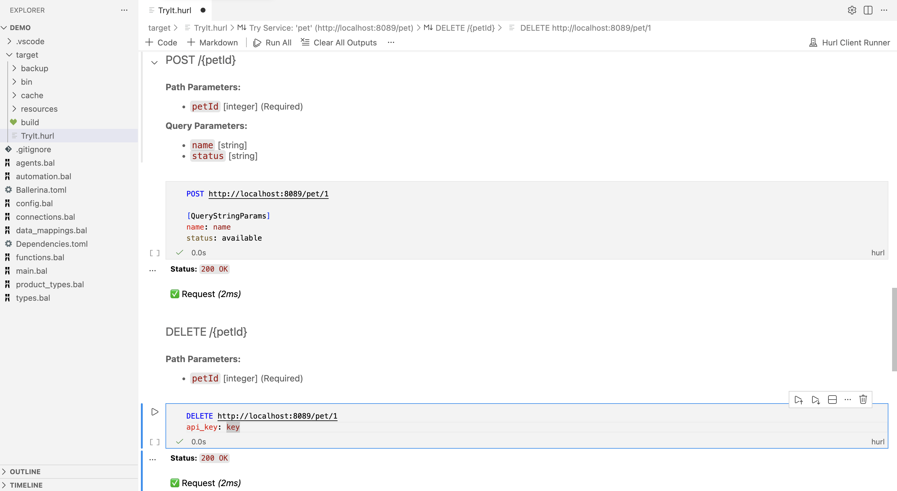

# Hurl Client

> This extension was developed to serve as the HTTP client for the [WSO2 Integrator](https://marketplace.visualstudio.com/items?itemName=WSO2.wso2-integrator).

Open, edit, and execute `.hurl` files as interactive notebooks in VS Code.

Each HTTP request in a `.hurl` file becomes a runnable notebook cell. Responses are displayed inline as formatted Markdown — status code, response body (pretty-printed JSON), and assertion results. Markdown cells provide rich documentation between requests.



## Getting Started

Right-click any `.hurl` file in the Explorer and choose **Hurl Client: Open Hurl Notebook**, or run the command from the Command Palette (`Cmd/Ctrl+Shift+P`).

## Commands

| Command | Description |
|---------|-------------|
| `Hurl Client: Open Hurl Notebook` | Open a `.hurl` file as a notebook (also available via right-click in Explorer) |
| `Hurl Client: Install Hurl` | Manually trigger the managed hurl binary download |
| `Hurl Client: Import Hurl String` | Create a notebook from a pasted hurl string (prompts for input if called from the Command Palette) |

## File Format

Hurl Client reads and writes standard `.hurl` files.

```hurl
POST https://api.example.com/users
Content-Type: application/json
{
  "name": "Alice"
}
```

## Chaining requests

Each request is its own notebook cell. Run a single cell by itself, and it runs on its own — with no access to variables captured by other cells.

To chain requests, so a variable captured in one is available to the next, run them **together**: select multiple cells (or use **Run All**) instead of running one at a time.

```hurl
POST https://api.example.com/login
Content-Type: application/json
{
  "username": "alice",
  "password": "secret"
}
HTTP 200
[Captures]
token: jsonpath "$.token"

GET https://api.example.com/profile
Authorization: Bearer {{token}}
HTTP 200
```

Select both cells above and run them together — `{{token}}` only resolves because the cell that captures it ran in the same invocation.

## Variables

To set your own variables (like a base URL or API key), create a file named `hurl.vars`:

```ini
base_url=https://api.example.com
api_key=your-api-key
```

Hurl Client looks for it in the folder set by `hurl-client.fileRoot`, which defaults to the notebook's own folder — so if you haven't changed that setting, put `hurl.vars` next to your `.hurl` files and it is picked up automatically. Reference the values as `{{base_url}}`, `{{api_key}}`, etc. in your requests.

Need a different value for just one file? Add `<filename>.hurl.vars` (e.g. `requests.hurl.vars` for `requests.hurl`) — it overrides the shared file for the values it defines.

Keep real secrets out of `hurl.vars` if you commit it to version control.

## Settings

| Setting | What it does |
|---------|---------------|
| `hurl-client.fileRoot` | Folder used for file references and for the shared `hurl.vars` file |
| `hurl-client.insecure` | Skip TLS certificate checks |
| `hurl-client.followRedirects` | Follow HTTP redirects |
| `hurl-client.extraArgs` | Pass any other hurl command-line flag not listed above |
